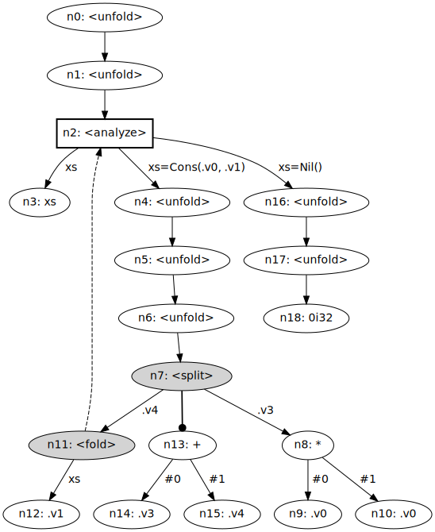

# Mazeppa
[](https://github.com/mazeppa-dev/mazeppa/actions)

Supercompilation [^turchin-concept] is a program transformation technique that symbolically evaluates a given program, with run-time values as unknowns. In doing so, it discovers execution patterns of the original program and synthesizes them into standalone functions; the result of supercompilation is a more efficient residual program. In terms of transformational power, supercompilation subsumes both deforestation [^deforestation] and partial evaluation [^partial-evaluation], and even exhibits certain capabilities of theorem proving.

_Mazeppa_ is a modern supercompiler intended to be a compilation target for call-by-value functional languages. Unlike previous supercompilers, Mazeppa 1) provides the full set of primitive data types, 2) supports manual control of function unfolding, 3) is fully transparent in terms of what decisions it takes during transformation, and 4) is designed with efficiency in mind from the very beginning.

## Installation

First, install the OCaml system on your machine:

```
$ bash -c "sh <(curl -fsSL https://raw.githubusercontent.com/ocaml/opam/master/shell/install.sh)"
$ opam init --auto-setup
```

Then clone the repository and install Mazeppa:

```
$ git clone https://github.com/mazeppa-dev/mazeppa.git
$ cd mazeppa
$ ./scripts/install.sh
```

Type `mazeppa --help` to confirm the installation.

## Hacking

You can play with Mazeppa without actually installing it. Having OCaml installed and the repository cloned (as above), run the following command from the root directory:


```
$ ./scripts/play.sh
```

(Graphviz is required: `sudo apt install graphviz`.)

This will launch Mazeppa with `--inspect` on `playground/main.mz` and visualize the process graph in `target/graph.svg`. The latter can be viewed in VS Code by the [Svg Preview] extension.

[Svg Preview]: https://marketplace.visualstudio.com/items?itemName=SimonSiefke.svg-preview

`./scripts/play.sh` will automatically recompile the sources in OCaml, if anything is changed.

## Supercompilation by example

The best way to understand how supercompilation works is by example. Consider the following function that takes a list and computes a sum of its squared elements:

[[`examples/sum-squares/main.mz`](examples/sum-squares/main.mz)]
```
main(xs) := sum(mapSq(xs));

sum(xs) := match xs {
    Nil() -> 0i32,
    Cons(x, xs) -> +(x, sum(xs))
};

mapSq(xs) := match xs {
    Nil() -> Nil(),
    Cons(x, xs) -> Cons(*(x, x), mapSq(xs))
};
```

This program is written in the idiomatic, _listful_ functional style. Every function does only one thing, and does it well. However, there is a serious problem here: `mapSq` essentially constructs a list that will be immediately deconstructed by `sum`, meaning that we 1) we need to allocate extra memory for the intermediate list, and 2) we need two passes of computation instead of one. The solution to this problem is called _deforestation_ [^deforestation], which is a special case of supercompilation.

Let us see what Mazeppa does with this program:

```
$ mkdir sum-squares
$ cd sum-squares
# Copy-paste the program above.
$ nano main.mz
$ mazeppa run --inspect
```

The `--inspect` flag tells Mazeppa to give a detailed report on the transformation process. The `sum-squares/target/` directory will contain the following files:

```
target
├── graph.dot
├── nodes.json
├── output.mz
└── program.json
```

 - `graph.dot` contains the complete _process graph_ for our program. You can obtain a picture of the graph by running `dot -Tsvg target/graph.dot > target/graph.svg`.
 - `nodes.json` contains the _contents_ of all nodes in the graph. Without this file, you would not be able to understand much from the graph alone.
 - `program.json` contains the initial program in _Mazeppa IR_: our supercompiler works with this particular representation instead of the original program.
 - `output.mz` contains the final residual program.

`output.mz` will contain the following code:

[[`examples/sum-squares/target/output.mz`](examples/sum-squares/target/output.mz)]
```
main(xs) := f0(xs);

f0(x0) := match x0 {
    Cons(x1, x2) -> +(*(x1, x1), f0(x2)),
    Nil() -> 0i32
};
```

The supercompiler has successfully merged `sum` and `mapSq` into a single function, `f0`! Unlike the original program, `f0` works in a single pass, without having to allocate any extra memory.

How did the supercompiler got to this point? Let us see the generated process graph:

<div align="center">
  
</div>

For reference, `nodes.json` contains the following data in JSON:

```json
[
  [ "n0", "main(xs)" ],
  [ "n1", "sum(mapSq(xs))" ],
  [ "n2", "sum(.g1(xs))" ],
  [ "n3", "xs" ],
  [ "n4", "sum(Cons(*(.v0, .v0), mapSq(.v1)))" ],
  [ "n5", ".g0(Cons(*(.v0, .v0), mapSq(.v1)))" ],
  [ "n6", "+(*(.v0, .v0), sum(mapSq(.v1)))" ],
  [ "n7", "+(*(.v0, .v0), sum(.g1(.v1)))" ],
  [ "n8", "*(.v0, .v0)" ],
  [ "n9", ".v0" ],
  [ "n10", ".v0" ],
  [ "n11", "sum(.g1(.v1))" ],
  [ "n12", ".v1" ],
  [ "n13", "+(.v3, .v4)" ],
  [ "n14", ".v3" ],
  [ "n15", ".v4" ],
  [ "n16", "sum(Nil())" ],
  [ "n17", ".g0(Nil())" ],
  [ "n18", "0i32" ]
]
```

(We will not need to inspect `program.json` for this tiny example, but feel free to look at it: it is not too complicated.)

The supercompiler starts with node `n0` containing `main(xs)`. After two steps of function unfolding, we reach node `n2` containing `sum(.g1(xs))`, where `.g1` is the IR function that corresponds to our `mapSq`. At this point, we have no other choice than to _analyze_ the call `.g1(xs)` by conjecturing what values `xs` might take at run-time. Since our `mapSq` only accepts the constructors `Nil` and `Cons`, it is sufficient to consider the cases `xs=Cons(.v0, .v1)` and `xs=Nil()` only.

Node `n4` is what happens after we substitute `Cons(.v0, .v1)` for `xs`, where `.v0` and `.v1` are fresh variables. After three more function unfoldings, we arrive at `n7`. This is the first time we have to _split_ the call `+(*(.v0, .v0), sum(.g1(.v1)))` into `.v3=*(.v0, .v0)` (`n8`) and `.v4=sum(.g1(.v1))` (`n11`) and proceed supercompiling `+(.v3, .v4)` (`n13`); the reason for doing so is that a previous node (`n2`) is structurally embedded in `n7`, so supercompilation might otherwise continue forever. Now, what happens with `sum(.g1(.v1))` (`n11`)? We have seen it earlier! Recall that `n2` contains `sum(.g1(xs))`, which is just a renaming of `sum(.g1(.v1))`; so we decide to _fold_ `n11` into `n2`, because it makes no sense to supercompile the same thing twice. The other branches of `n7`, namely `n13` and `n8`, are _decomposed_, meaning that we simply proceed transforming their arguments.

As for the other branch of `n2`, `sum(Nil())` (`n16`), it is enough to merely unfold this call to `0i32` (`n18`).

After the process graph is completed, residualization converts it to a final program. During this stage, dynamic execution patterns become functions -- node `n2` now becomes the function `f0`, inasmuch as some other node (`n11`) points to it. In any residual program, there will be exactly as many functions as there are nodes with incoming dashed lines, plus `main`.

In summary, supercompilation consists of 1) unfolding function definitions, 2) analyzing calls that pattern-match an unknown variable, 3) breaking down computation into smaller parts, 4) folding repeated computations, and 5) decomposing calls that cannot be unfolded, such as `+(.v3, .v4)` (`n13`) in our example. The whole supercompilation process is guaranteed to terminate, because when some computation is becoming dangerously bigger and bigger, we break it down into subproblems and solve them in isolation.

There are a plenty of other interesting examples of deforestation in the [`examples/`](examples/) folder, including tree-like data structures. In fact, we have reimplemented all samples from the previous work on higher-order call-by-value supercompilation by Peter A. Jonsson and Johan Nordlander [^CbV-supercomp] [^CbV-supercomp-next]; in all cases, Mazeppa has performed similarly or better.

## Specializing the power function

Now consider another example, this time involving partial evaluation:

[[`examples/power-sq/main.mz`](examples/power-sq/main.mz)]
```
main(a) := powerSq(a, 7u8);

powerSq(a, x) := match =(x, 0u8) {
    T() -> 1i32,
    F() -> match =(%(x, 2u8), 0u8) {
        T() -> square(powerSq(a, /(x, 2u8))),
        F() -> *(a, powerSq(a, -(x, 1u8)))
    }
};

square(a) := *(a, a);
```

`powerSq` implements the famous [exponentiation-by-squaring] algorithm. The original program is inefficient: it recursively examines the `x` parameter of `powerSq`, although it is perfectly known at compile-time. Running Mazeppa on `main(a)` will yield the following residual program:

[exponentiation-by-squaring]: https://en.wikipedia.org/wiki/Exponentiation_by_squaring

[[`examples/power-sq/target/output.mz`](examples/power-sq/target/output.mz)]
```
main(a) := *(a, let x0 := *(a, *(a, a)); *(x0, x0));
```

The whole `powerSq` function has been eliminated, thus achieving the effect of partial evaluation. (If we consider `powerSq` to be an interpreter for a program `x` and input data `a`, then it is the first Futamura projection: specializing an interpreter to obtain an efficient target program.) Also, notice how the supercompiler has managed to _share_ the argument `*(a, *(a, a))` twice, so that it is not recomputed each time anew. The residual program indeed reflects exponentiation by squaring.

## Synthesizing the KMP algorithm

Let us go beyond deforestation and partial evaluation. Consider a function `matches(p, s)` of two strings, which returns `T()` if `s` contains `p` and `F()` otherwise. The naive implementation in Mazeppa would be the following, where `p` is specialized to `"aab"`:

[[`examples/kmp-test/main.mz`](examples/kmp-test/main.mz)]
```
main(s) := matches(Cons('a', Cons('a', Cons('b', Nil()))), s);

matches(p, s) := go(p, s, p, s);

go(pp, ss, op, os) := match pp {
    Nil() -> T(),
    Cons(p, pp) -> goFirst(p, pp, ss, op, os)
};

goFirst(p, pp, ss, op, os) := match ss {
    Nil() -> F(),
    Cons(s, ss) -> match =(p, s) {
        T() -> go(pp, ss, op, os),
        F() -> failover(op, os)
    }
};

failover(op, os) := match os {
    Nil() -> F(),
    Cons(_s, ss) -> matches(op, ss)
};
```

(Here we represent strings as lists of characters for simplicity, but do not worry, Mazeppa provides built-in strings as well.)

The algorithm is correct but inefficient. Consider what happens when `"aa"` is successfully matched, but `'b'` is not. The algorithm will start matching `"aab"` once again from the second character of `s`, although it can already be said that the second character of `s` is `'a'`. The deterministic finite automaton built by the [Knuth-Morris-Pratt algorithm (KMP)] [^kmp] is an alternative way to solve this problem.

[Knuth-Morris-Pratt algorithm (KMP)]: https://en.wikipedia.org/wiki/Knuth%E2%80%93Morris%E2%80%93Pratt_algorithm

By running Mazeppa on the above sample, we can obtain an efficient string matching algorithm for `p="aab"` that reflects KMP in action:

[[`examples/kmp-test/target/output.mz`](examples/kmp-test/target/output.mz)]
```
main(s) := f0(s);

f0(x0) := match x0 {
    Cons(x1, x2) -> match =(97u8, x1) {
        F() -> f1(x2),
        T() -> f2(x2)
    },
    Nil() -> F()
};

f1(x0) := f0(x0);

f2(x0) := match x0 {
    Cons(x1, x2) -> match =(97u8, x1) {
        F() -> f1(x2),
        T() -> f4(x2)
    },
    Nil() -> F()
};

f3(x0) := f2(x0);

f4(x0) := match x0 {
    Cons(x1, x2) -> match =(98u8, x1) {
        F() -> match =(97u8, x1) {
            F() -> f1(x2),
            T() -> f4(x2)
        },
        T() -> T()
    },
    Nil() -> F()
};
```

The naive algorithm that we wrote has been automatically transformed into a well-known efficient version! While the naive algorithm has complexity _O(|p| * |s|)_, the specialized one is _O(|s|)_.

Synthesizing KMP is a standard example that showcases the power of supercompilation with respect to other techniques (e.g., see [^perfect-process-tree] and [^positive-supercomp]). Obtaining KMP by partial evaluation is not possible without changing the original definition of `matches` [^partial-evaluation-matches-1] [^partial-evaluation-matches-2].

## Metasystem transition

[Valentin Turchin], the inventor of supercompilation, describes the concept of [_metasystem transition_] in the following way [^turchin-mst-scp] [^turchin-transformation] [^turchin-dialogue]:

[Valentin Turchin]: https://en.wikipedia.org/wiki/Valentin_Turchin
[_metasystem transition_]: http://pespmc1.vub.ac.be/MST.html

> Consider a system _S_ of any kind. Suppose that there is a way to make some number of copies from it, possibly with variations. Suppose that these systems are united into a new system _S'_ which has the systems of the _S_ type as its subsystems, and includes also an additional mechanism which controls the behavior and production of the _S_-subsystems. Then we call _S'_ a metasystem with respect to _S_, and the creation of _S'_ a metasystem transition. As a result of consecutive metasystem transitions a multilevel structure of control arises, which allows complicated forms of behavior.

Thus, supercompilation can be readily seen as a metasystem transition: there is an object program in Mazeppa, and there is the Mazeppa supercompiler which controls and supervises execution of the object program. However, we can go further and perform any number of metasystem transitions within the realm of the object program itself, as the next example demonstrates.

We will be using the code from [`examples/lambda-calculus/`](examples/lambda-calculus/). Below is a standard [normalization-by-evaluation] procedure for obtaining beta normal forms of untyped lambda calculus terms:

[normalization-by-evaluation]: https://davidchristiansen.dk/tutorials/nbe/

```
indexEnv(env, idx) := match env {
    Nil() -> Panic(++("the variable is unbound: ", string(idx))),
    Cons(value, xs) -> match =(idx, 0u64) {
        T() -> value,
        F() -> indexEnv(xs, -(idx, 1u64))
    }
};

normalize(lvl, env, t) := quote(lvl, eval(env, t));

normalizeAt(lvl, env, t) := normalize(+(lvl, 1u64), Cons(vvar(lvl), env), t);

vvar(lvl) := Neutral(NVar(lvl));

eval(env, t) := match t {
    Var(idx) -> indexEnv(env, idx),
    Lam(body) -> Closure(env, body),
    Appl(m, n) ->
        let mVal := eval(env, m);
        let nVal := eval(env, n);
        match mVal {
            Closure(env, body) -> eval(Cons(nVal, env), body),
            Neutral(nt) -> Neutral(NAppl(nt, nVal))
        }
};

quote(lvl, v) := match v {
    Closure(env, body) -> Lam(normalizeAt(lvl, env, body)),
    Neutral(nt) -> quoteNeutral(lvl, nt)
};

quoteNeutral(lvl, nt) := match nt {
    NVar(var) -> Var(-(-(lvl, var), 1u64)),
    NAppl(nt, nVal) -> Appl(quoteNeutral(lvl, nt), quote(lvl, nVal))
};
```

(`eval`/`quote` are sometimes called `reflect`/`reify`.)

This is essentially a big-step machine for efficient capture-avoiding substitution: instead of reconstructing terms on each beta reduction, we maintain an _environment_ of values. `eval` projects a term to the "semantic domain", while `quote` does the opposite; `normalize` is simply the composition of `quote` and `eval`. To avoid bothering with fresh name generation, we put De Bruijn _indices_ in the `Var` constructor and De Bruijn _levels_ in `NVar`; the latter is converted into the former in `quoteNeutral`.

Now let us compute something with this machine:

```
main() := normalize(0u64, Nil(), example());

example() := Lam(pow(Var(0u64), seven()));

seven() := Lam(Lam(
    Appl(Var(1u64), Appl(Var(1u64), Appl(Var(1u64),
    Appl(Var(1u64), Appl(Var(1u64), Appl(Var(1u64),
    Appl(Var(1u64), Var(0u64))))))))));

pow(a, x) := Appl(x, a);
```

The body of `main` is a lambda term that normalizes a lambda abstraction that takes a [Church numeral] and multiplies it seven times.

[Church numeral]: https://en.wikipedia.org/wiki/Church_encoding#Church_numerals

By supercompiling `main()`, we obtain the following residual program:

[[`examples/lambda-calculus/target/output.mz`](examples/lambda-calculus/target/output.mz)]
```
main() := Lam(Lam(Appl(Var(1u64), Appl(Var(1u64), Appl(Var(1u64), Appl(Var(1u64)
    , Appl(Var(1u64), Appl(Var(1u64), Appl(Var(1u64), Var(0u64))))))))));
```

The lambda calculus interpreter has been completely annihilated!

In this example, we have just seen a two-level _metasystem stairway_ (in Turchin's terminology [^turchin-metavariables]): on level 0, we have the Mazeppa supercompiler transforming the object program, while on level 1, we have the object program normalizing lambda calculus terms. There can be an arbitrary number of interpretation levels, and Mazeppa can be used to collapse them all. This general behaviour of supercompilation was explored by Turchin himself in [^turchin-concept] (section 7), where he was able to supercompile two interpretable programs, one Fortran-like and one in Lisp, to obtain a speedup factor of 40 in both cases.

The lambda normalizer also shows us how to incarnate higher-order functions into a first-order language. In Mazeppa, we cannot treat functions as values, but it does not mean that we cannot simulate them! **By performing a metasystem transition, we can efficiently implement higher-order functions in a first-order language.** Along with defunctionalization and closure conversion, this technique can be used for compilation of higher-order languages into efficient first-order code.

Related example: [`examples/imperative-vm/`](examples/imperative-vm/).

## Restricting supercompilation

In retrospect, the major problem that prevented widespread adoption of supercompilation is its unpredictability -- the dark side of its power. To get a sense of what it means, consider how can we solve any SAT problem ["on the fly"]:

["on the fly"]: https://hirrolot.github.io/posts/sat-supercompilation.html

[[`examples/sat-solver/main.mz`](examples/sat-solver/main.mz)]
```
main(a, b, c, d, e, f, g) := solve(formula(a, b, c, d, e, f, g));

formula(a, b, c, d, e, f, g) :=
    and(or(Var(a), or(Not(b), or(Not(c), F()))),
    and(or(Not(f), or(Var(e), or(Not(g), F()))),
    and(or(Var(e), or(Not(g), or(Var(f), F()))),
    and(or(Not(g), or(Var(c), or(Var(d), F()))),
    and(or(Var(a), or(Not(b), or(Not(c), F()))),
    and(or(Not(f), or(Not(e), or(Var(g), F()))),
    and(or(Var(a), or(Var(a), or(Var(c), F()))),
    and(or(Not(g), or(Not(d), or(Not(b), F()))),
    T()))))))));

or(x, rest) := match x {
    Var(x) -> If(x, T(), rest),
    Not(x) -> If(x, rest, T())
};

and(clause, rest) := match clause {
    If(x, m, n) -> If(x, and(m, rest), and(n, rest)),
    T() -> rest,
    F() -> F()
};

solve(formula) := match formula {
    If(x, m, n) -> analyze(x, m, n),
    T() -> T(),
    F() -> F()
};

analyze(x, m, n) := match x {
    T() -> solve(m),
    F() -> solve(n)
};
```

There are two things wrong with this perfectly correct code: 1) the supercompiler will expand the formula in exponential space, and 2) the supercompiler will try to solve the expanded formula in exponential time. Sometimes, we just do not want to evaluate everything at compile-time.

However, despair not: we provide a solution for this problem. Let us first consider how to postpone solving the formula until run-time. It turns out that the only thing we need to do is to annotate the function `formula` with `@extract` as follows:

```
@extract
formula(a, b, c, d, e, f, g) :=
    // Everything is the same.
```

When Mazeppa sees `solve(formula(a, b, c, d, e, f, g))`, it extracts the call to `formula` into a fresh variable `.v0` and proceeds supercompiling the extracted call and `solve(.v0)` in isolation. The latter call will just reproduce the original SAT solver.

But supercompiling the call to `formula` will still result in an exponential blowup. Let us examine why this happens. Our original formula consists of calls to `or` and `and`; while `or` is obviously not dangerous, `and` propagates the `rest` parameter to _both_ branches of `If` (the first `match` case) -- this is the exact place where the blowup occurs. So let us mark `and` with `@extract` as well:

```
@extract
and(clause, rest) := match clause {
    // Everything is the same.
};
```

That is it! When `and` is to be transformed, Mazeppa will extract the call out of its surrounding context and supercompile it in isolation. By adding two annotations at appropriate places, we have solved both the problem of code blowup and exponential running time of supercompilation. In general, whenever Mazeppa sees `ctx[f(t1, ..., tN)]`, where `f` is marked `@extract` and `ctx[.]` is a non-empty surrounding context with `.` in a _redex position_, it will plug a fresh variable `v` into `ctx` and proceed transforming the following nodes separately: `f(t1, ..., tN)` and `ctx[v]`.

Finally, note that `@extract` is only a low-level mechanism; a compiler front-end must carry out additional machinery to tell Mazeppa which functions to extract. This can be done in two ways:
 - By static analysis of your object language/Mazeppa code. For example, parameter linearity analysis would mark both `formula` and `and` as extractable, leaving all other functions untouched.
 - By source code annotations, in a manner similar to [staged compilation].

[staged compilation]: https://okmij.org/ftp/ML/MetaOCaml.html

Both methods can be combined to achieve a desired effect.

## Mazeppa as a library

After running `./scripts/install.sh`, Mazeppa is available as an OCaml library!

Set up a new Dune project as follows:

```
$ dune init project my_compiler
```

Add `mazeppa` as a third-party library into your `bin/dune`:

```
(executable
 (public_name my_compiler)
 (name main)
 (libraries my_compiler mazeppa))
```

Paste the following code into `bin/main.ml` (this is [`examples/sum-squares/main.mz`](examples/sum-squares/main.mz) encoded in OCaml):

```ocaml
open Mazeppa

let input : Raw_program.t =
    let sym = Symbol.of_string in
    let open Raw_term in
    let open Checked_oint in
    [ [], sym "main", [ sym "xs" ], call ("sum", [ call ("mapSq", [ var "xs" ]) ])
    ; ( []
      , sym "sum"
      , [ sym "xs" ]
      , Match
          ( var "xs"
          , [ (sym "Nil", []), int (I32 (I32.of_int_exn 0))
            ; ( (sym "Cons", [ sym "x"; sym "xs" ])
              , call ("+", [ var "x"; call ("sum", [ var "xs" ]) ]) )
            ] ) )
    ; ( []
      , sym "mapSq"
      , [ sym "xs" ]
      , Match
          ( var "xs"
          , [ (sym "Nil", []), call ("Nil", [])
            ; ( (sym "Cons", [ sym "x"; sym "xs" ])
              , call
                  ( "Cons"
                  , [ call ("*", [ var "x"; var "x" ]); call ("mapSq", [ var "xs" ]) ] ) )
            ] ) )
    ]
;;

let () =
    try
      let output = Mazeppa.supercompile input in
      Printf.printf "%s\n" (Raw_program.show output)
    with
    | Mazeppa.Panic msg ->
      Printf.eprintf "Something went wrong: %s\n" msg;
      exit 1
;;
```

Run `dune exec my_compiler` to see the desired residual program:

```
[([], "main", ["xs"], (Raw_term.Call ("f0", [(Raw_term.Var "xs")])));
  ([], "f0", ["x0"],
   (Raw_term.Match ((Raw_term.Var "x0"),
      [(("Cons", ["x1"; "x2"]),
        (Raw_term.Call ("+",
           [(Raw_term.Call ("*", [(Raw_term.Var "x1"); (Raw_term.Var "x1")]));
             (Raw_term.Call ("f0", [(Raw_term.Var "x2")]))]
           )));
        (("Nil", []), (Raw_term.Const (Const.Int (Checked_oint.I32 0))))]
      )))
  ]
```

You can call Mazeppa as many times as you want, including in parallel. Note that we expose a limited interface that can only transform a value of type `Raw_program.t` into an optimized `Raw_program.t`, and nothing more.

## Usage considerations

 - Consider building Mazeppa with an [Flambda]-enabled OCaml compiler; to check, run `ocamlopt -config | grep flambda`.
 - Forget about `--inspect` in a real environment: use it only for debugging purposes.
 - Supercompiling a whole user program is not a good idea. Instead, consider supercompiling separate modules and then linking them together (the exact way you do so depends on your situation).
   - Although Mazeppa is itself not parallel, supercompiling separate modules can be done in parallel.
 - It is _much_ better if recursive functions reduce at least one argument structurally, just as in total functional programming. Otherwise, termination checking will not work well.

[Flambda]: https://ocaml.org/manual/latest/flambda.html

## Technical decisions

Mazeppa employs several interesting design choices (ranked by importance):

 - **First-order code.** Max Bolingbroke and Simon Peyton Jones [^supercomp-by-eval] report that for one particular example, their higher-order supercompiler for a subset of Haskell spent 42% of execution time on managing names and renaming. While it is true that simplistic evaluation models, such as normalization of lambda terms, permit us to avoid significant overhead of capture avoidance, supercompilation is more complicated. For example, besides doing symbolic computation, supercompilation needs to analyze previously computed results to make informed decisions about further transformation: consider term instance tests, homeomorphic embedding tests, most specific generalizations, etc. Introducing higher-order functions inevitably complicates all these analyses, making supercompilation slower, more memory-consuming, and harder to reason about. In Mazeppa, we stick with the philosophy of gradual improvements: instead of trying to handle many fancy features at the same time, we 1) fix the _core_ language for convenient manipulation by a machine, 2) perform as many metasystem transitions as necessary to make the core language better for human.

 - **Lazy constructors.** It is a well-known observation that call-by-value languages are hard for proper deforestation. It is still possible to deforest them, but not without additional analysis [^CbV-supercomp] [^CbV-supercomp-next]. However, if constructors are lazy (i.e., they do not evaluate their arguments), deforestation _just works_. Turchin made it work by normal-order transformation of a call-by-value language, but the result is that residual code may terminate more often. In Mazeppa, we have call-by-value functions and call-by-name (call-by-need) constructors, which 1) makes deforestation possible and 2) preserves the original semantics of code.
   - Incidentally, lazy constructors are also adopted by eager functional languages outside of supercompilation. See [_"Why is Idris 2 so much faster than Idris 1?"_](https://www.type-driven.org.uk/edwinb/why-is-idris-2-so-much-faster-than-idris-1.html) and _"CONS Should Not Evaluate its Arguments"_ [^cons-lazy-alloc].

 - **Term-free process graphs.** In Mazeppa, process graphs do not contain any references to terms: residualization can work without them. As a result, the garbage collector can deallocate terms that were used during construction of a subgraph. In addition ot that, this policy has several other important advantages: 1) the graph is still there for inspection with `--inspect`, 2) when it is drawn, it only reveals information about the _decisions_ the supercompiler has taken, which makes it much easier to look at. Several existing supercompilers refrain from proper process graphs (e.g., Neil Mitchell's Supero [^mitchell-supero] and the aforementioned [^supercomp-by-eval]), but as a result, 1) they are less capable of inspection by a user, 2) the algorithms become cluttered with code generation details.

 - **Two-dimensional configuration analysis.** Usually a supercompiler keeps a "history" of a subset of all ancestors while transforming a node; if this node is "close enough" to one of its ancestors, it is time to break the term into smaller parts to guarantee termination. In Mazeppa, we keep two separate data structures instead: the one containing a subset of node's ancestors and the one containing a subset of fully transformed nodes. The former data structure is used to guarantee termination (as usual), while the latter is used to enhance _sharing of functions_ in residual code. Specifically, if the current node (of special kind) is a renaming of some previously transformed node, we fold the current node into this previous node. This way, Mazeppa performs both _vertical_ and _horizontal_ analysis of configurations, which makes residual code more compact and supercompilation more efficient.

 - **Function productivity analysis.** When an inner function call pattern-matches an unknown value, two potentially dangerous things happen: 1) supercompilation reproduces the structure of the pattern-matching function, 2) supercompilation pushes the whole surrounding context to all branches of this function. Without further control, this situation can lead to significant explosion in code size, sometimes even causing a supercompiler not to terminate in a reasonable amount of time. To ameliorate, Mazeppa duplicates the context iff this inner call produces a _definite top-level value_ from _at least one_ exit point, because if it does, great chances that this value can be deconstructed by subsequent pattern matching. Otherwise, Mazeppa extracts the inner call and transforms it in isolation (just as if it was marked with `@extract`). Furthermore, if the context is actually duplicated, the following rule applies to all branches: if the branch produces a definite top-level value from _all_ exit points, it is transformed in the context as usual; otherwise, the branch is extracted from the context and transformed in isolation. In practice, this analysis prevents a huge amount of unneeded specializations, thereby compactifying residual program size and making supercompilation much more tractable.
   - We perform productivity analysis strictly _before_ supercompilation. The algorithm launches global analysis for all f- and g-rules present in Mazeppa IR, and has linear time complexity.
   - An emergent effect is that after extracting these pattern-matching calls, horizontal configuration analysis becomes able to fold more repeated computations.

 - **Smart histories.** Instead of blindly comparing a current node with all its ancestors, we employ a more fine-grained control, that is: 1) global nodes (the ones that analyze an unknown variable) are compared with global nodes only, 2) local nodes (the ones that reduce linearly in a single step) are compared with local nodes only up to the latest global node, but not including it, and 3) trivial nodes (the ones that break down terms into smaller components) are not compared with anything else. Besides a more economic approach to termination checking, this scheme allows Mazeppa to discover more optimization opportunities; see [^metric-space], sections 4.6 and 4.7. Termination of supercompilation is guaranteed by the fact that homeomorphic embedding is still tested on all potentially infinite subsequences of global and local terms (there cannot exist an infinite sequence of trivial terms only).

 - **Normalization during unfolding.** When a function call is unfolded, we substitute the parameters and normalize the body as much as possible (i.e., without further unfoldings, to guarantee termination). To see why, consider the factorial function `f(n)`; with simple unfolding, we would trap in an unpleasant situation where `f(1u32)` is embedded into `*(1u32, f(-(1u32, 1u32)))`, causing _over-generalization_. In reality, Mazeppa would unfold `f(1u32)` to `*(1u32, f(0u32))`, making the latter a candidate for further unfolding. This approach was suggested in [^supercomp-code-explosion], section 4.5. Its other merits are: 1) less work for future driving steps, 2) less "banal" computation in process graphs, 3) reduced amount of expensive homeomorphic embedding tests.
   - Besides folding constants, we also perform algebraic simplification such as _+(t, 0), +(0, t) -> t_, _-(t, 0) -> t_, _*(t, 0), *(0, t) -> 0_, etc. These can be seen as axioms for built-in types.

 - **Implementation in OCaml.** Mazeppa is implemented using a combination of functional and imperative programming styles, which is very natural to do in OCaml. Exceptions are used not only for "exceptional" situations, mutability inside functions is common. Although we do not have a similar supercompiler written in e.g. Haskell or Rust for comparison, we believe that it is OCaml that gave us a working implementation without having to quarrel with the language and never finishing work.

While most of the above is not particularly novel, we believe that the combination of these features makes Mazeppa a more practical alternative than its predecessors.

## Further research

 - Can supercompilation be used to erase unnecessary information from dependently typed programs [^dependent-types-erasure]?
 - Is it possible to devise heuristics that would guarantee predictability of supercompilation? (E.g., by dynamically marking misbehaving functions as extractable.)
 - What if we [partially evaluate](https://ocaml.org/manual/latest/flambda.html) the supercompiler based on a set of function definitions (e.g., some fixed interpreter)? This could make supercompilation significantly more efficient.
 - _Equality indices_ [^equality-indices] can enhance dynamic sharing of arguments. Would it be beneficial to implement them in Mazeppa?
 - Suppose that there exists a dirty language _L_, a pure interpreter _I_ for _L_, and a fixed program _P_ in _L_. By supercompiling _I(P, data)_, where _data_ is unknown, we should be able to automatically _purify_ the program _P_! Likewise, we should be able to purify not only all programs in _L_, but also all dirty languages with interpretive definitions in Mazeppa.

## A note about built-in panics

Some built-in operations raise a panic on certain conditions. Consider the following program:

```
main(x) := ignore(+(x, 100u8));

ignore(_x) := 5u8;
```

It will be supercompiled as follows:

```
main(x) := 5u8;
```

These two programs are not semantically equivalent! Whereas the former one raises a panic if `x` is `200u8`, the latter does not. In general, Mazeppa can remove some built-in panics from the original program, or make them happen at some later point.

Is this an appropriate behaviour?

We believe it is. Take the semantics of Rust for example: when the code is compiled in the debug mode, integer overflow/underflow operations raise a panic, but in the release mode, they do not (modular arithmetic is used instead). The reason is that checked arithmetic introduces an overhead, and so application testing should detect those panics. The Rust compiler essentially changes the semantics of code depending on a compilation mode; as a result, some release programs may execute longer and terminate more often.

In practice, this scheme usually works well. While it is theoretically possible to preserve even built-in panics at the cost of additional analyses, we decide to keep the current behaviour as it is.

## Language definition

### Lexical structure

A _symbol_ `<SYMBOL>` is a sequence of letters (`a`, _..._, `z` and `A`, _..._, `Z`) and digits (`0`, _..._, `9`), followed by an optional question mark (`?`), followed by an optional sequence of `'` characters. The underscore character (`_`) may be the first character of a symbol, which may informally indicate that the value or function being defined is not used; otherwise, the first character must be a letter. The following sequences of characters are also permitted as symbols: `~`, `#`, `+`, `-`, `*`, `/`, `%`, `|`, `&`, `^`, `<<`, `>>`, `=`, `!=`, `>`, `>=`, `<`, `<=`, `++`. The following are _reserved words_ that may **not** be used as symbols: `match`, `let`.

There are four classes of _unsigned integer constants_:
 - Binary: `0b` (`0B`) followed by a non-empty sequence of binary digits `0` and `1`.
 - Octal: `0o` (`0O`) followed by a non-empty sequence of octal digits `0`, _..._, `7`.
 - Decimal: a non-empty sequence of decimal digits `0`, _..._, `9`.
 - Hexadecimal: `0x` (`0X`) followed by a non-empty sequence of decimal digits `0`, _..._, `9` and letters `a`, _..._, `f` (`A`, _..._, `F`).

Notes:
 - For convenience of reading, each unsigned integer constant may contain underscore characters (`_`) except for the first position in the sequence of digits.
 - For each unsigned integer constant, there is a _negated integer constant_ formed by the negation character (`-`) placed right before the sequence of digits and underscore characters.
 - For each unsigned and negated integer constant, there is a _typed integer constant_ `<INT>` produced by appending an integer type `<INT-TY>` (`u8`, `u16`, `u32`, `u64`, `u128`, `i8`, `i16`, `i32`, `i64`, `i128`) right after the original integer constant. For example, the constants `123i8`, `123u16`, and `123i32` all belong to the set `<INT>`.

A _string constant_ `<STRING>` is a sequence, between double quotes (`"`), of zero or more printable characters (we refer to printable characters as those numbered 33-126 in the ASCII character set), spaces, or _string escape sequences_:

| Escape sequence | Meaning |
|----------|----------|
| `\f` | Form feed (ASCII 12) |
| `\n` | Line feed (ASCII 10) |
| `\r` | Carriage return (ASCII 13) |
| `\t` | Horizontal tab (ASCII 9) |
| `\v` | Vertical tab (ASCII 11) |
| `\xhh` | ASCII code in hexadecimal |
| `\"` | `"` |
| `\\` | `\` |

where `h` is either `0`, _..._, `9` or `a`, _..._, `f` or `A`, _..._, `F`.

A _character constant_ `<CHAR>` is either a sole character enclosed in single quotes (`'`) or a _character escape sequence_ enclosed in single quotes. The character escape sequence is the same as for strings, except that `\"` is replaced by `\'`.

There are no other constants in Mazeppa.

A _comment_ `<COMMENT>` is any sequence of characters after `//`, which is terminated by a newline character. (We only allow single-line comments for simplicity.)

### Surface syntax

The entry point `<program>` is defined by the following rules:
 - `<def-attr-list>` `<SYMBOL>` `(` `<SYMBOL>`, _..._, `<SYMBOL>` `)` `:=` `<term>` `;` `<program>`
 - `<COMMENT>` `<program>`
 - (Empty string.)

where `<def-attr-list>` is a whitespace-separated sequence of _function attributes_ (the same attribute can occur multiple times). Right now, the only allowed function attribute is `@extract`.

`<term>` is defined as follows:
 - `<SYMBOL>` (a variable)
 - `<const>` (a constant)
 - `<SYMBOL>` `(` `<term>`, _..._, `<term>` `)` (a function call)
 - `match` `<term>` `{` `<match-case>`, _..._, `<match-case>` `}` (pattern matching)
 - `let` `<SYMBOL>` `:=` `<term>` `;` `<term>` (a let-binding)
 - `let` `<pattern>` `:=` `<term>` `;` `<term>` (a pattern let-binding)
 - `<COMMENT>` `<term>` (a comment)

The rest of the auxiliary rules are:

`<const>`:
 - Either `<INT>` or `<STRING>` or `<CHAR>`.

`<match-case>`:
 - `<pattern>` `->` `<term>`

`<pattern>`:
 - `<SYMBOL>` `(` `<SYMBOL>`, _..._, `<SYMBOL>` `)`.

In Mazeppa, primitive operations employ the same syntax as that of ordinary function calls. To distinguish between the two, we define `<op1>` and `<op2>` to be the following sets of symbols:
 - `<op1>` is one of `~`, `#`, `length`, `string`, `<INT-TY>`.
 - `<op2>` is one of `+`, `-`, `*`, `/`, `%`, `|`, `&`, `^`, `<<`, `>>`, `=`, `!=`, `>`, `>=`, `<`, `<=`, `++`, `get`.

Furthermore, `<op2>` has the following subclasses:
 - `<arith-op2>` is one of `+`, `-`, `*`, `/`, `%`, `|`, `&`, `^`, `<<`, `>>`.
 - `<cmp-op2>` is one of `=`, `!=`, `>`, `>=`, `<`, `<=`.

### Restrictions

 - **Per-program:** 1) No symbol can be called with a different number of arguments. 2) If some function is defined with _N_ parameters, it must be called with exactly _N_ arguments. 3) No two functions can define the same symbol.
 - **Per-function:** 1) No function can redefine a primitive operator `<op1>` or `<op2>`. 2) A function must define a symbol starting with a lowercase letter. 3) No duplicate symbols can occur among function parameters. 4) Every free variable inside a function body must be bound by a corresponding parameter in the function definition.
 - **Per-term:** 1) The sequence of cases in `match { ... }` must not be empty. 2) No duplicate constructors can occur among case patterns in `match { ... }`. 3) No duplicate symbols can occur among pattern parameters `C(x1, ..., xN)`. 4) No let-binding can bind `<op1>` or `<op2>`. 5) `Panic` must be called with only one argument; `T` and `F` with zero arguments.

If a program, function, or term conforms to these restrictions, we call it _well-formed_.

### Desugaring

| Original form | Desugared form | Notes |
|----------|----------|----------|
| `// ...` `rest` | `rest` | `rest` is in `<program>` or `<term>` |
| `let p := t; u` | `match t { p -> u }` | `p` is in `<pattern>` |
| `c` | _ASCII(c)_ | `c` is in `<CHAR>` |

where _ASCII(c)_ is an appropriate `u8` integer constant, according to the ASCII table; for example, _ASCII(`'a'`)_ is `97u8`.

### Evaluation

Suppose that _t_ is a well-formed term closed under environment _env_ (defined below) and _program_ is a well-formed program. Then the evaluation of _t_ is governed by the following big-step environment machine:
 - `eval(env, x) = eval({ }, env(x))`
 - `eval(env, const) = const`, where `const` is in `<const>`.
 - `eval(env, f(t1, ..., tN)) =`
   - `t1Val ^= eval(env, t1)`
   - _..._
   - `tNVal ^= eval(env, tN)`
   - `eval(env[x1 -> t1Val, ..., xN -> tNVal], body)`, where `f(x1, ..., xN) := body;` is in _program_.
 - `eval(env, C(t1, ..., tN)) = C(t1[env], ..., tN[env])`, where `C` starts with an uppercase letter.
 - `eval(env, op(t)) =`
   - `tVal ^= eval(env, t)`
   - `evalOp1(op, tVal)`, where `op` is in `<op1>`.
 - `eval(env, op(t1, t2)) =`
   - `t1Val ^= eval(env, t1)`
   - `t2Val ^= eval(env, t2)`
   - `evalOp2(t1Val, op, t2Val)`, where `op` is in `<op2>`.
 - `eval(env, match t { p1 -> t1, ..., pN -> tN }) =`
   - `Ci(s1, ..., sN) ^= eval(env, t)`
   - `eval(env', tI)`, where
     - `Ci(x1, ..., xN) -> tI` is among the rules in `match t { ... }`, and
     - `env'` is `env[x1 -> s1, ..., xN -> sN]`.
 - `eval(env, let x := t; u) =`
   - `tVal ^= eval(env, t)`
   - `eval(env[x -> tVal], u)`

Notation:
 - `env` is a _total environment_ over _t_, whose general form is `{ x1 -> t1, ..., xN -> tN }`. Each `tI` term must be closed and well-formed; this property is preserved by `eval`.
 - `env(x)` is `tI`, where `x -> tI` is in `env`.
 - `env[x1 -> t1, ..., xN -> tN]` is the environment `env` extended with new bindings `x1 -> t1`, _..._, `xN -> tN`. If some `xI` is already bound in `env`, it is rebound.
 - `t[env]` denotes a _simultaneous substitution_ of all free variables in `t` by their bound values in `env`.
 - `tVal ^= eval(env, t)` evaluates `t` under `env`; then:
   - If it is `Panic(t')`, the result of the _whole_ evaluation rule is `Panic(t')`.
   - Otherwise, `tVal` is available for the next clauses.

(Note that `eval` is a partial function, so evaluation of _t_ can "get stuck" without a superimposed type system.)

In what follows, 1) signed integers are represented in two's complement notation, 2) _panic_ denotes `Panic(s)`, where `s` is some (possibly varying) implementation-defined string constant.

`evalOp1` takes care of the unary operators for primitive types (`x` is in `<INT>`, `s` is in `<STRING>`):
 - `evalOp1(~, x)` is the bitwise negation of `x` of the same type.
 - `evalOp1(string, x)` is the string representation of `x` (in decimal).
 - `evalOp1(ty, x)`, where `ty` is in `<INT-TY>`, is `x` converted to an integer of type `ty`.
   - If `x` is not in the range of `ty`, the result is _panic_.
 - `evalOp1(#, x)`, where `x` is a `u8` integer, is a string containing only the ASCII character of `x`.
   - If `x` is not printable, the result takes the form `"\xhh"`.
 - `evalOp1(length, s)` is a `u64` integer denoting the length of `s`.
 - `evalOp1(string, s)` is `s`.

Likewise, `evalOp2` takes care of the binary operators for primitive types:
 - `evalOp2(x, op, y)`, where `x` and `y` have the same integer type and `op` is in `<arith-op2>`, performs a corresponding arithmetic operation on `x` and `y`, yielding a value of the same type as that of `x` and `y`.
   - If the value is not representable in that type, the result is _panic_.
 - `evalOp2(x, op, y)`, where `x` and `y` have the same integer type and `op` is in `<cmp-op2>`, performs a corresponding comparison operation on `x` and `y`, yielding either `T()` or `F()`.
 - `evalOp2(s1, op, s2)`, where `s1` and `s2` are strings and `op` is in `<cmp-op2>`, performs a corresponding lexicographical comparison on `s1` and `s2`, yielding either `T()` or `F()`.
 - `evalOp2(s1, ++, s2)` is the concatenation of `s1` and `s2`.
 - `evalOp2(s, get, idx)`, where `idx` is a `u64` integer, is the `idx`-th character (of type `u8`) of `s`.
   - If `idx` is out of bounds, the result is _panic_.

The definition of `eval` is now complete.

## Release procedure

 1. Update the `version` field in `dune-project` and `bin/main.ml`.
 1. Type `dune build` to generate `mazeppa.opam`.
 1. Update `CHANGELOG.md`.
 1. Release the project in [GitHub Releases].

[GitHub Releases]: https://github.com/mazeppa-dev/mazeppa/releases

## FAQ

### Is Mazeppa production-ready?

Not yet, we need to battle-test Mazeppa on some actual programming language. Our long-term goal is to [find suitable heuristics] to profitably supercompile _any_ source file under 10'000 LoC (in Mazeppa).

[find suitable heuristics]: https://github.com/mazeppa-dev/mazeppa/issues/2

### How can I execute programs in Mazeppa?

For debugging and other purposes, we provide a built-in interpreter that can execute Mazeppa programs. You can launch it by typing `mazeppa eval` (make sure that your `main` function does not accept parameters). We are also working on a [Mazeppa-to-C translator], which will enable compilation to zero-overhead machine code.

[Mazeppa-to-C translator]: https://github.com/mazeppa-dev/mazeppa/issues/1

### How can I perform I/O in Mazeppa?

Since Mazeppa is a purely functional language, the only way to implement I/O is as in Haskell [^awkward-squad]: having a pure program that performs computation and a dirty runtime that performs side effects issued by the program. There are no plans to introduce direct I/O into Mazeppa: it will only make everything more complicated.

### Will Mazeppa have a type system?

No, we do not think that a type system is necessary at this point. It is the responsibility of a front-end compiler to ensure that programs do not "go wrong".

### Can I use Mazeppa for theorem proving?

The more we make supercompilation predictable, the less it is capable of theorem proving. For those interested in program analysis rather than optimization, we suggest looking into _distillation_ [^distillation-theorem-proving].

### Where can I learn more about supercompilation?

For the English audience, the following paper presents a decent introduction into supercompilation:
 - [_"Supercompilation: Ideas and Methods"_](https://themonadreader.wordpress.com/wp-content/uploads/2014/04/super-final.pdf) [^supercomp-ideas-and-methods]

However, the following papers in Russian describe a supercompilation model that is closer the majority of existing supercompilers, including Mazeppa:
 - [_"Supercompilation: main principles and basic concepts"_](https://keldysh.ru/papers/2018/prep2018_111.pdf) [^supercomp-main-principles]
 - [_"Supercompilation: homeomorphic embedding, call-by-name, partial
evaluation"_](https://keldysh.ru/papers/2018/prep2018_209.pdf) [^supercomp-homeomorphic]

Mazeppa itself is inspired by this excellent paper (in English):
 - _"A Roadmap to Metacomputation by Supercompilation"_ [^metacomp-by-supercomp]

### Can supercompilation be even more powerful?

Several approaches can lead to _superlinear speedup_ of non-esoteric programs by supercompilation:

 - _Jungle driving_ (appeared 2001) [^jungle-driving] uses _jungle evaluation_ [^jungle-evaluation] as an advanced driving strategy for first-order positive supercompilation. The key idea behind jungle evaluation is to share as much computation as theoretically possible by reducing graphs (jungles) instead of terms. Consider that the structure of a supercompiled program reflects the way it will be executed at run-time; in turn, the strategy of driving is what affects the structure. Driving jungles instead of terms can therefore lead to _exponentially_ more efficient residual programs, but the (seemingly inevitable) cost of managing jungles remains at compile-time!
 - _Distillation_ (appeared 2007) [^distillation] [^distillation-essence] [^distillation-graphs] [^distillation-lts] is an upgraded version of higher-order positive supercompilation. The main difference is that generalization and folding are performed with respect to graphs instead of terms, thus allowing the [distiller] to make more insightful decisions about program transformation.
   - Furthermore, distillation can be employed to define a [_hierarchy of program transformers_] [^hamilton-700], where each higher-level transformer is progressively more powerful than lower-level ones.
 - _Higher-level supercompilation_ [^higher-level-supercomp] utilizes lower-level supercompilers to discover lemmas about term equivalences, which are then used by higher-level supercompilers for insightful term rewriting. However, to the best of our knowledge, no fully automatic procedure for discovering (and applying) lemmas in the infinite search space has been proposed yet.

[distiller]: https://github.com/poitin/Distiller
[_hierarchy of program transformers_]: https://github.com/poitin/Higher-Level-Transformer

None of the above is planned to be implemented in Mazeppa, because 1) we think that writing asymptotically good programs is the responsibility of the programmer, not the optimizer, and 2) predictability of supercompilation is of greater importance to us. However, for those who are interested in this topic, the references may be helpful.

### How do I contribute?

Just fork the repository, work in your own branch, and submit a pull request. Prefer rebasing when introducing changes to keep the commit history as clean as possible.

## References

[^turchin-concept]: Valentin F. Turchin. 1986. The concept of a supercompiler. ACM Trans. Program. Lang. Syst. 8, 3 (July 1986), 292–325. https://doi.org/10.1145/5956.5957

[^deforestation]: Philip Wadler. 1988. Deforestation: transforming programs to eliminate trees. Theor. Comput. Sci. 73, 2 (June 22, 1990), 231–248. https://doi.org/10.1016/0304-3975(90)90147-A

[^partial-evaluation]: Futamura, Y. (1983). Partial computation of programs. In: Goto, E., Furukawa, K., Nakajima, R., Nakata, I., Yonezawa, A. (eds) RIMS Symposia on Software Science and Engineering. Lecture Notes in Computer Science, vol 147. Springer, Berlin, Heidelberg. https://doi.org/10.1007/3-540-11980-9_13

[^CbV-supercomp]: Peter A. Jonsson and Johan Nordlander. 2009. Positive supercompilation for a higher order call-by-value language. SIGPLAN Not. 44, 1 (January 2009), 277–288. https://doi.org/10.1145/1594834.1480916

[^CbV-supercomp-next]: Jonsson, Peter & Nordlander, Johan. (2010). Strengthening supercompilation for call-by-value languages.

[^kmp]: D. E. Knuth, J. H. Morris, and V. R. Pratt. Fast pattern matching in strings. SIAM Journal on Computing, 6:page 323 (1977).

[^perfect-process-tree]: Glück, R., Klimov, A.V. (1993). Occam's razor in metacomputation: the notion of a perfect process tree. In: Cousot, P., Falaschi, M., Filé, G., Rauzy, A. (eds) Static Analysis. WSA 1993. Lecture Notes in Computer Science, vol 724. Springer, Berlin, Heidelberg. https://doi.org/10.1007/3-540-57264-3_34

[^positive-supercomp]: Sørensen MH, Glück R, Jones ND. A positive supercompiler. Journal of Functional Programming. 1996;6(6):811-838. doi:10.1017/S0956796800002008

[^partial-evaluation-matches-1]: Consel, Charles, and Olivier Danvy. "Partial evaluation of pattern matching in strings." Information Processing Letters 30.2 (1989): 79-86.

[^partial-evaluation-matches-2]: Jones, Neil & Gomard, Carsten & Sestoft, Peter. (1993). Partial Evaluation and Automatic Program Generation.

[^turchin-mst-scp]: Turchin, V.F. (1996). Metacomputation: Metasystem transitions plus supercompilation. In: Danvy, O., Glück, R., Thiemann, P. (eds) Partial Evaluation. Lecture Notes in Computer Science, vol 1110. Springer, Berlin, Heidelberg. https://doi.org/10.1007/3-540-61580-6_24

[^turchin-transformation]: Turchin, Valentin F. "Program transformation with metasystem transitions." Journal of Functional Programming 3.3 (1993): 283-313.

[^turchin-dialogue]: Turchin, Valentin F.. “A dialogue on Metasystem transition.” World Futures 45 (1995): 5-57.

[^turchin-metavariables]: Turchin, V., and A. Nemytykh. Metavariables: Their implementation and use in Program Transformation. CCNY Technical Report CSc TR-95-012, 1995.

[^supercomp-by-eval]: Maximilian Bolingbroke and Simon Peyton Jones. 2010. Supercompilation by evaluation. In Proceedings of the third ACM Haskell symposium on Haskell (Haskell '10). Association for Computing Machinery, New York, NY, USA, 135–146. https://doi.org/10.1145/1863523.1863540

[^cons-lazy-alloc]: Friedman, Daniel P. and David S. Wise. “CONS Should Not Evaluate its Arguments.” International Colloquium on Automata, Languages and Programming (1976).

[^mitchell-supero]: Mitchell, Neil. “Rethinking supercompilation.” ACM SIGPLAN International Conference on Functional Programming (2010).

[^metric-space]: Sørensen, M.H.B. (1998). Convergence of program transformers in the metric space of trees. In: Jeuring, J. (eds) Mathematics of Program Construction. MPC 1998. Lecture Notes in Computer Science, vol 1422. Springer, Berlin, Heidelberg. https://doi.org/10.1007/BFb0054297

[^supercomp-code-explosion]: Jonsson, Peter & Nordlander, Johan. (2011). Taming code explosion in supercompilation. PERM'11 - Proceedings of the 20th ACM SIGPLAN Workshop on Partial Evaluation and Program Manipulation. 33-42. 10.1145/1929501.1929507.

[^dependent-types-erasure]: Tejiščák, Matúš. Erasure in dependently typed programming. Diss. University of St Andrews, 2020.

[^equality-indices]: Glück, Robert, Andrei Klimov, and Antonina Nepeivoda. "Nonlinear Configurations for Superlinear Speedup by Supercompilation." Fifth International Valentin Turchin Workshop on Metacomputation. 2016.

[^awkward-squad]: Peyton Jones, Simon. (2002). Tackling the Awkward Squad: monadic input/output, concurrency, exceptions, and foreign-language calls in Haskell.

[^supercomp-ideas-and-methods]: Klyuchnikov, Ilya, and Dimitur Krustev. "Supercompilation: Ideas and methods." The Monad. Reader Issue 23 (2014): 17.

[^supercomp-main-principles]: Klimov, Andrei & Romanenko, Sergei. (2018). Supercompilation: main principles and basic concepts. Keldysh Institute Preprints. 1-36. 10.20948/prepr-2018-111.

[^supercomp-homeomorphic]: Romanenko, Sergei. (2018). Supercompilation: homeomorphic embedding, call-by-name, partial evaluation. Keldysh Institute Preprints. 1-32. 10.20948/prepr-2018-209.

[^metacomp-by-supercomp]: Robert Glück and Morten Heine Sørensen. 1996. A Roadmap to Metacomputation by Supercompilation. In Selected Papers from the International Seminar on Partial Evaluation. Springer-Verlag, Berlin, Heidelberg, 137–160.

[^jungle-driving]: Secher, J.P. (2001). Driving in the Jungle. In: Danvy, O., Filinski, A. (eds) Programs as Data Objects. PADO 2001. Lecture Notes in Computer Science, vol 2053. Springer, Berlin, Heidelberg. https://doi.org/10.1007/3-540-44978-7_12

[^jungle-evaluation]: Hoffmann, B., Plump, D. (1988). Jungle evaluation for efficient term rewriting. In: Grabowski, J., Lescanne, P., Wechler, W. (eds) Algebraic and Logic Programming. ALP 1988. Lecture Notes in Computer Science, vol 343. Springer, Berlin, Heidelberg. https://doi.org/10.1007/3-540-50667-5_71

[^distillation]: Hamilton, Geoff. (2007). Distillation: Extracting the essence of programs. Proceedings of the ACM SIGPLAN Symposium on Partial Evaluation and Semantics-Based Program Manipulation. 61-70. 10.1145/1244381.1244391.

[^distillation-essence]: Hamilton, G.W. (2010). Extracting the Essence of Distillation. In: Pnueli, A., Virbitskaite, I., Voronkov, A. (eds) Perspectives of Systems Informatics. PSI 2009. Lecture Notes in Computer Science, vol 5947. Springer, Berlin, Heidelberg. https://doi.org/10.1007/978-3-642-11486-1_13

[^distillation-graphs]: Hamilton, Geoff & Mendel-Gleason, Gavin. (2010). A Graph-Based Definition of Distillation.

[^distillation-lts]: Hamilton, Geoff & Jones, Neil. (2012). Distillation with labelled transition systems. Conference Record of the Annual ACM Symposium on Principles of Programming Languages. 15-24. 10.1145/2103746.2103753.

[^distillation-theorem-proving]: G. W. Hamilton. 2006. Poitín: Distilling Theorems From Conjectures. Electron. Notes Theor. Comput. Sci. 151, 1 (March, 2006), 143–160. https://doi.org/10.1016/j.entcs.2005.11.028

[^hamilton-700]: Hamilton, Geoff. "The Next 700 Program Transformers." International Symposium on Logic-Based Program Synthesis and Transformation. Cham: Springer International Publishing, 2021.

[^higher-level-supercomp]: Klyuchnikov, Ilya, and Sergei Romanenko. "Towards higher-level supercompilation." Second International Workshop on Metacomputation in Russia. Vol. 2. No. 4.2. 2010.
